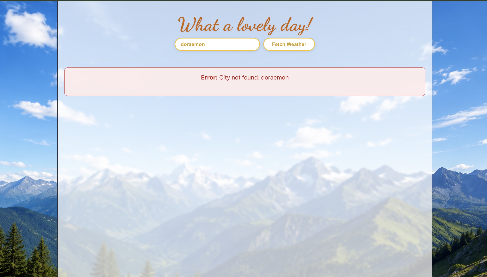
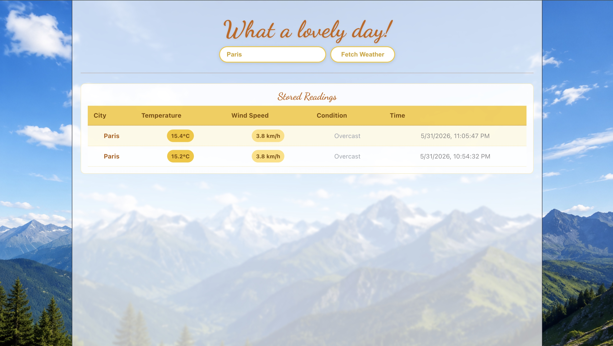
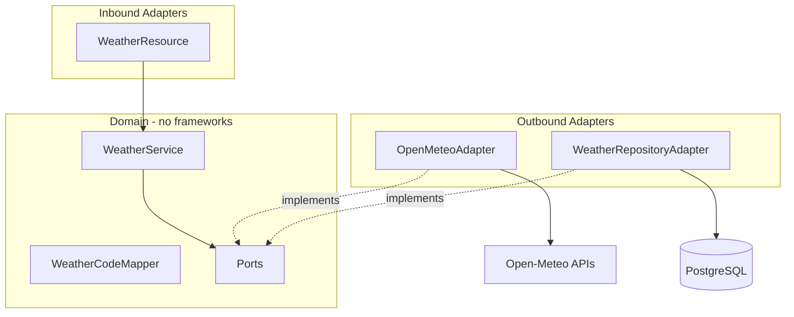

# Weather Aggregator

A full-stack weather aggregation service built with **Quarkus 3** (Java 21) and **React + Vite**, following **Hexagonal Architecture (Ports & Adapters)**. It fetches current weather from [Open-Meteo](https://open-meteo.com) (no API key), stores readings in **PostgreSQL**, and exposes a REST API plus a simple React UI.

---

## Screenshots





---

## Architecture



| Layer | Package | Responsibility |
|-------|---------|----------------|
| Domain | `domain.model`, `domain.service`, `domain.ports`, `domain.exceptions` | Business logic, no framework imports |
| Inbound | `adapters.in.rest` | REST API, exception mappers |
| Outbound | `adapters.out.openmeteo`, `adapters.out.persistence` | Open-Meteo REST client, JPA repository |
| Config | `config` | CDI wiring (`WeatherService` producer) |

---

## Prerequisites

| Tool | Version |
|------|---------|
| Java (JDK) | 21+ |
| Node.js | 18+ |
| Docker | For PostgreSQL |

---

## Run the application

**1. Start PostgreSQL**

```bash
docker compose up -d
```

**2. Backend** (project root)

```bash
./mvnw quarkus:dev
```

API: [http://localhost:8080](http://localhost:8080)

**3. Frontend**

```bash
cd frontend
npm install
npm run dev
```

UI: [http://localhost:5173](http://localhost:5173)

### Automated setup (macOS / Linux / WSL)

```bash
chmod +x setup.sh
./setup.sh
```

---

## REST API

| Method | Path | Description |
|--------|------|-------------|
| POST | `/weather/fetch?city={city}` | Geocode city, fetch current weather, store in DB, return saved record |
| GET | `/weather/{city}` | All readings for city, **most recent first** |
| GET | `/weather/{city}/latest` | Most recent reading only |

---

## Database

PostgreSQL via Docker (`docker-compose.yml`):

- Host: `localhost:5432`
- Database: `weatherdb`
- User / password: `weather` / `weather`

Configured in `src/main/resources/application.properties`.

---

## Testing

### Run all tests (backend + frontend)

```bash
# macOS / Linux / WSL
./run-all-tests.sh

# Windows PowerShell
.\run-all-tests.ps1
```

Equivalent manual command:

```bash
./mvnw test && cd frontend && npm test
```

### Run all backend tests

```bash
./mvnw test
```

Includes unit, Pact, Testcontainers DB adapter, WireMock service tests, and Cucumber BDD (3 scenarios).

### Run suites separately

| Suite | Command |
|-------|---------|
| Unit (domain/service) | `./mvnw test -Dtest=WeatherServiceTest` |
| Integration (DB + Testcontainers) | `./mvnw test -Dtest=WeatherRepositoryAdapterTest` |
| Pact consumer | `./mvnw test -Dtest=OpenMeteoPactConsumerTest` |
| Pact provider verification | `./mvnw test -Dtest=OpenMeteoPactProviderTest` |
| Service (WireMock + full app) | `./mvnw test -Dtest=WeatherResourceTest` |
| BDD (Cucumber) | `./mvnw test -Dtest=RunCucumberTest` |
| Frontend (React Testing Library) | `cd frontend && npm test` |

### Test strategy

1. **Unit tests** — `WeatherService` with mocked ports (no HTTP, no DB).
2. **Pact** — Consumer contracts for Open-Meteo geocoding + forecast; provider verification replays pact against WireMock.
3. **Integration tests** — Real PostgreSQL via Testcontainers; `WeatherRepositoryAdapter` save/find/order/latest.
4. **Service tests** — Full Quarkus app, WireMock stubs external API, RestAssured hits REST endpoints.
5. **BDD** — Cucumber scenarios reuse the same WireMock + Postgres test resources.
6. **Frontend** — Vitest + React Testing Library component tests for `App`.

---

## Tradeoffs

- **PostgreSQL everywhere** — Matches interview spec; Docker Compose for local dev; Testcontainers for integration tests.
- **WireMock on port 8089** — Shared test resource for service tests and Cucumber; avoids hitting real Open-Meteo in CI.
- **WMO weather codes** — Mapped in `WeatherCodeMapper` (domain, framework-free).
- **Exception JSON** — `{ "error": "..." }` for 400/404/429 via JAX-RS `ExceptionMapper`s.

---

## Tech stack

- **Backend:** Quarkus 3.36, Hibernate ORM Panache, REST Client, Java 21
- **Frontend:** React 19, Vite, Axios
- **Database:** PostgreSQL 16
- **Testing:** JUnit 5, Mockito, Pact, Testcontainers, WireMock, Cucumber, Vitest, React Testing Library
